# The POPI-model, a Point-validated Pixel-based Breathing Thorax Model

## Motivation

We believe research on deformable image registration (DIR) of the lungs will greatly benefit from making image and validation data publicly available. Several 4D CT data sets, acquired at the Léon Bérard Cancer Center, can be downloaded here for use in your research. Along with the images, we provide large sets of manually identified landmarks, allowing you to validate your motion estimation.

We welcome all suggestions that can make this data more useful for you.  _David Sarrut_,  **[david.sarrut[at]creatis.insa-lyon.fr](mailto:david.sarrut@creatis.insa-lyon.fr)**

## Quick Downloads

By downloading this data, you agreeing to follow these guidelines. When using any of the data provided for publications, please make reference to:

-   The institution from which they were obtained:  _the Léon Bérard Cancer Center & CREATIS Laboratory, Lyon, France._
    
-   The article containing the proposition of this initiative:
    
    **Vandemeulebroucke, J., Sarrut, D. and Clarysse, P.**
    
    _**The POPI-model, a point-validated pixel-based breathing thorax model.**_
    
    **In  _Proceeding of the XVth ICCR Conference_, Toronto, Canada. 2007**.  [pdf](https://github.com/open-vv/popi-model/blob/master/Vandemeulebroucke2007.pdf "pdf")
    
| Type of Data | Links || 
| ----- | ---- | ---- |
| Images | [Original Images (Dicom)](http://tux.creatis.insa-lyon.fr/~srit/POPI/Images/Dicom) | [Preprocessed Images (MetaImage)](http://tux.creatis.insa-lyon.fr/~srit/POPI/Images/MetaImage) |
|  **Please note that all of the provided data below is referenced with respect to the dimensions of the preprocessed image!** |||
| Vectorfields | [Non-Parametric Method](http://tux.creatis.insa-lyon.fr/~srit/POPI/VectorFields/Non-Parametric) | [Parametric Method](http://tux.creatis.insa-lyon.fr/~srit/POPI/VectorFields/Parametric) |
| Landmarks | [Landmarks](http://tux.creatis.insa-lyon.fr/~srit/POPI/Landmarks) | TRE results are shown below |
| Additional Data | [Masks](http://tux.creatis.insa-lyon.fr/~srit/POPI/Masks) ||

## Data Description

| _The freely available  **POPI-model**  could be usefull when working on motion compensated reconstruction (CT, TEP),4D dosimetry, 4D deformable registration, lung deformation estimation, monte-carlo simulations... This validated data set can serve as a reference so please feel free to incorporate it into your work._ |||
| - | - | - |
| 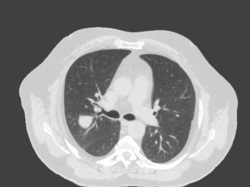 | 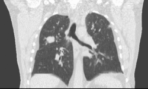 | 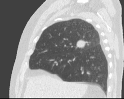 |
| Axial view | Coronal view | Sagital view |

_The freely available  **POPI-model**  could be usefull when working on motion compensated reconstruction (CT, TEP),4D dosimetry, 4D deformable registration, lung deformation estimation, monte-carlo simulations... This validated data set can serve as a reference so please feel free to incorporate it into your work._

You will find on this site the  [original dicom images](http://tux.creatis.insa-lyon.fr/~srit/POPI/Images/Dicom)  of a 4D CT series, made up of ten 3D volumes representing ten different phases of one breathing cycle. In addition we provide a modified,  [preprocessed version](http://tux.creatis.insa-lyon.fr/~srit/POPI/Images/MetaImage)  of this 4D image that was used by us for further processing (images were cropped to their bounding box and background was removed). Between two phases of the 4D CT series we estimated the breathing motion, resulting in  [vector fields](http://tux.creatis.insa-lyon.fr/~srit/POPI/VectorFields/Non-Parametric)  that maps voxels from one phase to homologous voxels of the other phase. These deformation fields were obtained through two different approaches (parametric and non-parametric) and freely downloadable.

The precision of both vector fields was thoroughly evaluated using landmarks identified by medical experts in each of the 3D volumes. The  [landmarks](http://tux.creatis.insa-lyon.fr/~srit/POPI/Landmarks)  (a set of 3D points) that were used for this evaluation are made available, along with the Target Registration Error (TRE) results of the vector field with respect to these landmarks.

In the section "Additional data" we provide  [masks](http://tux.creatis.insa-lyon.fr/~srit/POPI/Masks), segmenting the images into air, body and lungs are available.

### Images

Images were acquired on a 16 Slice Brilliance CT Big Bore Oncology™ configuration (Philips). Breathing correlated information was obtained using the associated Pneumo Chest bellows™ (Lafayette Instruments). For this specific acquisition the following parameters were used: Tube Tension = 120kV, Field Of View = 500mm, Exposure = 400 mA/slice, Gantry Rotation Time = 0.5s, Collimation= 16 x 1.5mm , Pitch = 0.15.

#### Original Images (Dicom)

The original dicom images were anonymized and organized into 10 folders containing the dicom slices of each 3D volume. Folders were named "00", "10", .., "90"; while corresponding slices are found as "00-slice001.dcm". Each slice has a resolution of 0.976562mm x 0.976562mm and a thickness of 2mm. The resulting volume size of one 3D volume is 512 x 512 x 141. The images can be downloaded as tar-file per volume (e.g. 00-Dicom.tar ~ 77MB) or as a 4D data set (4DCT-Dicom.tar ~ 773MB),  [here](http://tux.creatis.insa-lyon.fr/~srit/POPI/Images/Dicom).

#### Preprocessed Images (MetaImage)

For the sake of efficiency, the original Dicom images were preprocessed.  **Please note that all of the provided data below is referenced with respect to the dimensions of this preprocessed image!**  However, this data can be easily used in combination with the Dicom images as well with knowledge of the preprocessing procedure described below.

First the images were reduced in the X and Y dimension to the smallest size still containing all patient features. All of the background was removed from the image and set to -1000HU. The size of this working image is 482 x 360 x 141; the resolution remains unchanged: 0.976562mm x 0.976562mm and a slice thickness of 2mm. It was obtained by removing 4 voxels at the lower end of the X dimension and 26 at the higher, and by removing 19 voxels at the lower end of the Y dimension and 133 at the higher.

The working image is provided in raw format (eg. 00-P.raw), with an associated header file (eg. 00-P.mhd) respecting the  MetaImage file format. The header file contains all necessary information such as image size, voxelspacing, anatomical orientation, voxel representation, endianess and so on. Different 3D volumes can be downloaded seperately (eg: 00-MetaImage.tar ~ 47MB), or in one tar-file ( 4DCT-MetaImage.tar ~ 470MB),  [here](http://tux.creatis.insa-lyon.fr/~srit/POPI/Images/MetaImage).

### Vector Fields

Motion estimation was performed considering a Lagrangian description of space. Displacement of material points were estimated in all 3D volumes with respect to a reference volume, chosen to be 10-P.mhd. This reference corresponds to the end-inhalation phase. All vector fields map the coordinates of the voxels in the reference image to their coordinates in another image. The vector field mapping reference 10-P.mhd into  **X**0-P.mhd is named VF1**X**.vf. The vector field format with extension  _.vf_  is organised in the following manner. The first two lines are in readable ASCII format, the first representing a magic number, the second containing the size and spacing. From then on a Little Endian binary floating point representation in voxel units of the three components of a vector are given. First all the x, then all the y and finally the z components are enumarated in the same order as the voxels are organised in the MetaImage file format.

#### Non-Parametric Method

| _The result of the deformable registration between the reference 10-P.mhd (inspriration) and 60-P.mhd (expiration) is shown below. The vectors were projected on the three image planes which are only partially visualized._ |||
| - | - | - |
| 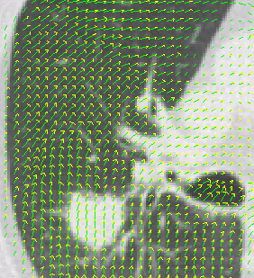 | 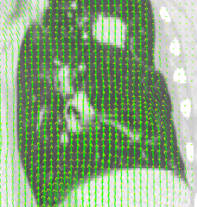 | 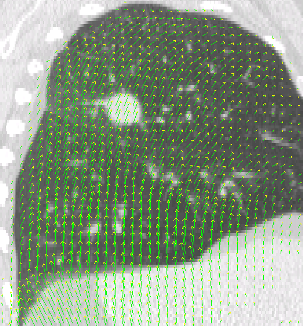 |
| Axial view | Coronal view | Sagital view |

An implementation of the Demons algorithm was used to obtain vector fields that deformably register the reference phase to all other volumes. Registration was performed between the preprocessed images (eg. : 10-P.mhd and 40-P.mhd), using a multi-resolution scheme with final resolution of 2mm x 2mm x 2mm.

While up to now few efforts were made to optimize the computational cost of the algorithm, we mention the execution times on a standard PC with one 2.33GHz CPU. For 162338 voxels (that is the number of voxels of the image resampled to a 3mm voxelsize), It takes the algorithm 10s to perform 15 iterations (2.33 GHz computer, non-threaded implementation). For 5831760 voxels (that is the number of voxels of the image resampled to a 3mm voxelsize), it takes the algorithm about 10s to perform 4 iterations. For the generation of these vectorfields the number of iterations was deliberatly chosen very high, to ensure complete convergence of the algorithm in all areas of the image. At the 3mm resolution level an average of 500 iterations were permitted, while at 2mm resolution level another 700 were allowed. One (over)intensive registration as described above takes about 35min, making a total of 5 hours for the complete motion model.

The vector fields obtained through deformable registration are provided at a 2mm x 2mm x 2mm resolution resulting in a size of 235 x 176 x 141. They can be downloaded separately (eg: VF14.vf ~ 66MB) or in a single tar-file (4DVF.tar ~ 600MB),  [here](http://tux.creatis.insa-lyon.fr/~srit/POPI/VectorFields/Non-Parametric).

#### Parametric Method

| _The result of the free-form deformation between the reference 10-P.mhd (inspriration) and 60-P.mhd (expiration) is shown below. The vectors were projected on the three image planes which are only partially visualized._ |||
| - | - | - |
| 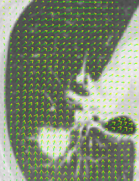 | 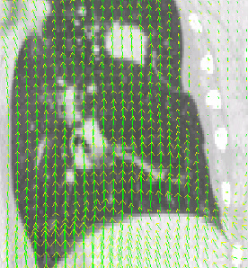 | 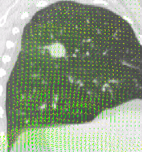 |
| Axial view | Coronal view | Sagital view |

The parametric registration is a particular implementation of Rueckert's free-form deformation [Delhay 2005] implemented using a multi-scale / multiresolution piramid. The parametric representation was obtained using cubic B-spline base functions. From the final solution vector fields at discrete grid positions were extracted with a resolution of 2mm x 2mm x 2mm. They can be downloaded separately (eg: VF14.vf ~ 66MB) or in a single tar-file (4DVF.tar ~ 600MB),  [here](http://tux.creatis.insa-lyon.fr/~srit/POPI/VectorFields/Parametric).

### Landmarks

The accuracy of the vector fields was assessed by the use of soft or retrospective landmarks. Medical experts identified homologous points in all 3D volumes. For illustration purpose, the distribution of the landmarks is shown, in the next figures, projected on the three body planes. Note that some points appear to be located outside of the body, because of the choice of slice onto which all points were projected. 41 points in each of the 3D volumes are provided. The last point corresponds to an image artifact and was provided as an illustration. It's TRE is however not taken into account in the results presented below. The landmarks can be downloaded for each of the volumes separately (eg: 10-Landmarks.pts) or as a 4D set (4DLandmarks.tar),  [here](http://tux.creatis.insa-lyon.fr/~srit/POPI/Landmarks). Points coordinates are expressed according to the first voxel reference frame (not according to the center of the image).

_Landmarks were identified by medical experts. The distance between the position were a physician identified a landmark and were the vector fields located the landmark, the TRE, provides an evaluation of the results of the motion estimation. To visualize their distribution in the 3D volumes their projections on the three body planes are shown below._
| _Landmarks were identified by medical experts. The distance between the position were a physician identified a landmark and were the vector fields located the landmark, the TRE, provides an evaluation of the results of the motion estimation. To visualize their distribution in the 3D volumes their projections on the three body planes are shown below._ |||
| - | - | - |
| 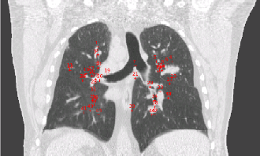 | 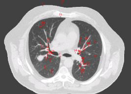 | 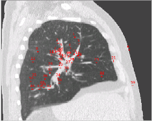 |
| Coronal view | Axial view |Sagital view |

By calculating the distance between these points and the corresponding deformed points from the reference phase, a Target Registration Error (TRE) can be calculated.

-   For the non-parametric method, the mean TRE for the 40 first landmarks and all registrations is 1.2mm with a standard deviation of 0.4mm, while the maximum TRE is 2.6mm. Taking into account that all images have slice spacing of 2mm and that consequently, landmark identification can induce an error of up to 2mm, this result was considered acceptable. The results of the mean and maximal TRE are given below for each of the provided vector fields.

| Vector Field | Mean Orignal Distance / Standard deviation (mm) | Mean TRE / Standard deviation (mm) | Maximum TRE (mm) |
| --- | --- | --- | --- |
| VF10.vf | 0.5 / 0.5 | 1.3 / 0.3 | 1.8 |
| VF12.vf | 0.5 / 0.6 | 1.4 / 0.2 | 2.1 |
| VF13.vf | 2.2 / 1.8 | 1.4 / 0.4 | 2.3 |
| VF14.vf | 4.3 / 2.5 | 1.2 / 0.4 | 2.3 |
| VF15.vf | 5.8 / 2.6 | 1.3 / 0.5 | 2.6 |
| VF16.vf | 6.1 / 2.9 | 1.1 / 0.4 | 2.0 |
| VF17.vf | 5 / 2.3 | 1.3 / 0.5 | 2.4 |
| VF18.vf | 3.7 / 1.6 | 1.1 / 0.3 | 1.7 |
| VF19.vf | 2.1 / 1.1 | 1.1 / 0.3 | 1.9 |
| Total | 3.3 / 2 | 1.2 / 0.4 | 2.6 |

-   For the parametric method, the mean TRE for the 40 first landmarks and all registrations is 1.0mm with a standard deviation of 0.5mm, while the maximum TRE is 3.2mm. Again taking into account that all images have slice spacing of 2mm and that consequently landmark identification can induce an error of up to 2mm, this result was also considered acceptable. The results of the mean and maximal TRE are given below for each of the provided vector fields.

| Vector Field | Mean Orignal Distance / Standard deviation (mm) | Mean TRE / Standard deviation (mm) | Maximum TRE (mm) |
| --- | --- | --- | --- |
| VF10.vf | 0.5 / 0.5 | 0.8 / 0.3 | 1.5 |
| VF12.vf | 0.5 / 0.6 | 0.8 / 0.5 | 2.2 |
| VF13.vf | 2.2 / 1.8 | 1.1 / 0.5 | 2.8 |
| VF14.vf | 4.3 / 2.5 | 1.1 / 0.5 | 2.4 |
| VF15.vf | 5.8 / 2.6 | 1.1 / 0.6 | 3.2 |
| VF16.vf | 6.1 / 2.9 | 1.2 / 0.6 | 3.2 |
| VF17.vf | 5.0 / 2.3 | 1.2 / 0.6 | 3.0 |
| VF18.vf | 3.7 / 1.6 | 0.9 / 0.5 | 2.3 |
| VF19.vf | 2.1 / 1.1 | 0.9 / 0.5 | 2.0 |
| Total | 3.3 / 2 | 1.0 / 0.5 | 3.2 |

### Additional Data

#### Masks

Through simple thresholding and connected labelling techniques, delimitations of the air, lungs and the remainder of the body were obtained. The were bundled in MetaImage file formats, with the same resolution and size as the preprocessed images. Regions in the  **X**-P.mhd volume that correspond to air, lungs and the remainder of the present features will carry the labels 1, 0 and 2 respectively in the  **X**-air-lungs-body.mhd mask. Please note that the chosen pixel representation for the masks is unsigned char. They can be downloaded separately (eg: 40Mask-MetaImage.tar ~ 23 MB) or as a single 4D set (4DMask.tar ~ 230MB),  [here](http://www.creatis.insa-lyon.fr/~srit/POPI/Masks).

## Other Useful Links

-   VV, a 4D image viewer can be downloaded from  [https://github.com/open-vv/vv](https://github.com/open-vv/vv)
    
-   More inhale-exhale image pairs of the thorax, along with landmarks, can be found on  [http://www.dir-lab.com/](http://www.dir-lab.com/)
    
-   More data sets for validation and evaluation in medical image processing can be found on  [http://www.vmip.org/](http://www.vmip.org/).

